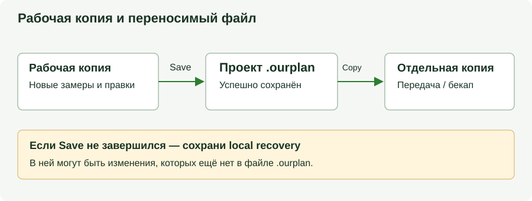

# Создание Job и где что лежит

Проверено по OurPlanCore **2.2.7 Preview, 6 сентября 2026**. Здесь — создание,
открытие, сохранение и восстановление проекта. Новые команды доступны в новой
версии; старый установленный выпуск автоматически не заменяется.

!!! abstract "Что копировать для передачи и резервного хранения"
    **Новый проект — один файл `.ourplan`.** Сначала нажми `Save` и дождись
    успеха, затем копируй этот файл. Старые проекты в папках сохраняют прежний
    формат: для них нужна вся папка. Локальная рабочая копия приложения и
    резервная копия на другом диске выполняют разные задачи.

## Как создать job { .kb-section-title .kb-st--green }

На ленте `Main` открой `Open / Import`. В меню:

| Пункт | Действие |
| --- | --- |
| `Open project...` | Общий список файлов `.ourplan` и существующих проектных папок; есть выбор файла и папки. |
| `Blank project - start empty` | Введи имя, выбери место сохранения `.ourplan`, затем добавь листы. |
| `New project from a folder of PDFs...` | Выбери папку с PDF, введи имя проекта и укажи файл `.ourplan`. PDF из папки и подпапок импортируются в новый проект. |
| `Import PDF Takeoffs...` | Выбери PDF с аннотациями, проверь найденные замеры и укажи новый или текущий проект. |
| `Sample job (demo to explore)` | Учебный проект для знакомства с инструментами. |
| `Manage job folders...` | Добавь или выбери корневую папку поиска проектов. |

`Ctrl+O` и `Ctrl+Shift+O` открывают общий выбор проекта при стандартных
назначениях. Менять их можно в [Keyboard Shortcuts](ourplanecore.md#hotkeys).

!!! note "PlanSwift — отдельный формат исходника"
    Кнопка `PlanSwift` импортирует исходный проект PlanSwift в отдельный проект.
    `Open / Import → Import into the current job → PlanSwift project...`
    добавляет его в уже открытый. Уже преобразованный проект OurPlanCore
    открывай через `Open project...`.

## Импорт в существующий job { #import-existing .kb-section-title .kb-st--orange }

Сначала проверь имя открытого проекта и нужную область дерева.

| Маршрут | Что импортируется | Внутренняя организация |
| --- | --- | --- |
| `Import into the current job → PDF file(s)...` / `Add Pages` | Один или несколько PDF с подтверждением имён листов | Листы под `Pages/00. imported` |
| `Import into the current job → Folder of PDFs...` | PDF из папки и подпапок без отдельного вопроса об имени каждого листа | Листы под `Pages/00. imported` |
| `Import into the current job → PlanSwift project...` | Листы и takeoffs исходного PlanSwift | Группы `01. planswift` в Pages и Takeoffs |
| `PDF Takeoffs → Import into current job` | Редактируемые линии, площади, counts и выбранные аннотации | Группы `from pdf` и отчёт импорта |
| `Blank Sheet` | Пустой лист | В выбранной области Pages |

В PlanSwift-импорте листы без замеров по умолчанию могут пропускаться; для полного
набора используй `Import all PlanSwift sheets and takeoff folders`.
PDF Takeoffs сначала показывает результат сканирования: проверь типы, масштаб
и целевой проект перед подтверждением. Обычная картинка или линия в PDF не
обязательно содержит структуру редактируемого takeoff.

## Галочка «растр» при импорте PDF { #raster .kb-section-title .kb-st--violet }

В `Import PDF Options` есть
`Build readable raster cache and strict black-line snap index`.

- Включено: импорт дополнительно готовит растр и индекс чёрных линий; это требует
  времени и места на диске. Исходный PDF сохраняется.
- Выключено: этот дополнительный кеш сразу не создаётся. Рендер PDF остаётся
  доступен; возможности привязок зависят от режима и подготовленных индексов.
- Выбор запоминается. Итог импорта показывает число подготовленных и неудачных
  листов; ошибка подготовки кеша требует проверки конкретного листа.

Для уже импортированных листов открой `Sheet Manager`, выдели нужные листы,
выбери PNG и DPI, нажми `Prepare`, затем включи `Raster First On`. Включение
Raster First само по себе не создаёт недостающие картинки. Если нужны
подготовленные варианты, не очищай их командой `Clean`.

Растр ускоряет повторное открытие и меняет способ показа листа. Он не добавляет
деталей, которых нет в исходном изображении. Изменение DPI не меняет масштаб
замеров. После подготовки проверь читаемость и привязки на заполненном листе.

## Куда сохраняется сам job { .kb-section-title .kb-st--cyan }

**Для нового проекта конечный путь выбираешь в окне `Save Project`.** Папка
текущего проекта, выбранный jobs root и сохранённые roots помогают выбрать
начальную папку диалога; они не отменяют выбранное тобой место.

| Операция | Файл `.ourplan` | Старый проект-папка |
| --- | --- | --- |
| `Save` / `Ctrl+S` | Обновляет тот же файл после сохранения рабочих данных | Сохраняет данные в той же папке |
| `Save As...` / `Ctrl+Shift+S` | Создаёт новый `.ourplan` в выбранном месте | Создаёт новую папку-копию; формат остаётся папочным |
| Передача на другой компьютер | Передай успешно сохранённый `.ourplan` | Передай всю папку проекта |

`Save As...` доступен через меню экспорта и палитру команд. Не меняй расширение
папки или ZIP вручную для преобразования формата.

### Автосохранение и рабочая копия

<figure markdown>
  
  <figcaption>Перед передачей нужна успешная запись переносимого файла.</figcaption>
</figure>

У `.ourplan` есть два этапа сохранения:

1. Изменения замеров сохраняются в локальную рабочую копию.
2. Приложение обновляет переносимый `.ourplan` отдельным checkpoint.
   Автоматическая упаковка ждёт паузы и выполняется реже сохранения замеров.

Сообщение о сохранении в **local recovery** ещё не означает, что переносимый
файл обновлён. Перед передачей или бекапом нажми `Save`, дождись успеха и проверь
сообщение. При ошибке держи приложение открытым и следуй предложенному пути
Retry / Save As / сохранения recovery.

Не удаляй рабочую копию при ошибке упаковки: в ней могут быть изменения, которых
ещё нет в `.ourplan`. Если файл изменён другим процессом, приложение сохраняет
локальную работу и блокирует молчаливую перезапись внешнего варианта.

### Настройки и профили

Обычный профиль хранит настройки в `%APPDATA%\OurPlanCore`, локальные данные —
в `%LOCALAPPDATA%\OurPlanCore`. Изолированный Preview может использовать свой
каталог с отдельными `roaming` и `local`; список недавних проектов и горячие
клавиши поэтому могут отличаться между выпусками.

Место проекта выбирается отдельно от профиля. Установка новой программы не
переносит автоматически проекты и все настройки старой версии.

## Что появляется на диске { .kb-section-title .kb-st--magenta }

Для `.ourplan` структура ниже находится **внутри пакета и его рабочей копии**.
Для старого папочного проекта она видна непосредственно в папке. Это справочная
карта; для обычного открытия распаковывать `.ourplan` вручную не нужно.

```text
Рабочие данные проекта
├─ Data.xml                     карточка проекта
├─ sources/                     исходные материалы, включённые в проект
├─ Pages/
│  └─ .../A-101/
│     ├─ Data.xml               видимое имя и порядок
│     ├─ source.json            источник листа, номер страницы, масштаб
│     ├─ source_pdf.json        метаданные исходного PDF, если есть
│     ├─ layers.json            настройки слоёв, если есть
│     ├─ annotations.json       аннотации, если есть
│     └─ raster/                подготовленные изображения, если есть
├─ Takeoffs/
│  └─ .../Exterior 2x6/
│     ├─ Data.xml               свойства takeoff
│     └─ measurements.json      геометрия замеров и связь с листами
├─ AI_Context/                  контекст, запросы, настройки проекта
├─ import_reports/              отчёты импорта, если есть
└─ bookmarks.json               закладки, если есть
```

Рабочая копия также содержит служебные записи блокировки и восстановления.
Пакет формируется по правилам отбора и переносимости; временные файлы и все
неактивные варианты кеша не обязаны попадать в него.

!!! info "Имя на диске и имя в дереве"
    Папка на диске может иметь техническое уникальное имя. Видимое имя хранится
    в метаданных. При копировании Pages/Takeoffs человеческое имя сохраняется;
    техническая уникальность не требует добавлять к нему `Copy` или `(2)`.

## Где лежат листы (sheets) { #sheets .kb-section-title .kb-st--orange }

Лист описывается `source.json`: источник изображения/PDF, индекс страницы,
масштаб и связанные параметры. Несколько листов могут ссылаться на разные
страницы одного исходного PDF.

Импорт копирует используемые PDF в проект; при сохранении пакета программа
подготавливает переносимые ссылки. Для проверки переноса открой сохранённую
копию в другом месте и проверь несколько листов и экспорт. Одно имя файла не
доказывает, что внешний источник был включён.

`source_pdf.json` содержит дополнительные метаданные для распознавания имён и
масштаба. Он не заменяет основной источник листа. Пути в обоих файлах не следует
редактировать вручную во время работы программы.

## Где лежат takeoff'ы { #takeoffs .kb-section-title .kb-st--violet }

Takeoff — отдельный контейнер замеров под `Takeoffs`, а не часть папки листа.
`Data.xml` хранит свойства контейнера; `measurements.json` — точки/контуры,
масштаб и другие параметры каждого замера. Поле `page_folder` связывает замер
с листом. Один takeoff может содержать замеры с нескольких листов.

При открытии листа показываются связанные с ним видимые замеры. Отсутствие
объекта на экране может быть связано с другим листом, скрытым takeoff или
неверной связью; оно само по себе не доказывает удаление данных.

## Восстановление и резервные копии { #backup .kb-section-title .kb-st--green }

- Для бекапа `.ourplan` сначала заверши `Save`, затем скопируй файл под отдельным
  именем или на другой диск. Проверка бекапа — открыть копию и проверить листы,
  замеры и сохранение.
- Для старого проекта сохраняй всю папку. Копия во время активной записи может
  содержать файлы разных моментов; сначала заверши сохранение.
- `.snapshots` содержит снимки выбранных метаданных. Это **не полный бекап**
  исходных PDF, всех AI-материалов, пользовательских настроек и приложения.
- `Undo Last Page Sort` / `Undo Last Page Operation` работают с журналом
  соответствующих операций. Это не универсальный откат любой правки за всё
  время существования проекта.
- Встроенный recovery не компенсирует потерю диска с единственным проектом.
  Для этого нужна отдельная сохранённая копия.

## Если листы или takeoff'ы «пропали» { #lost .kb-section-title .kb-st--orange }

| Симптом | Проверка и действие |
| --- | --- |
| Замеры отсутствуют на экране | Проверь активный лист, видимость takeoff и выбранный проект. При переносе старой папки проверь `Repair Links`; не создавай замеры повторно до выяснения причины. |
| Защищённый JSON метаданных в открытом проекте | `Open / Import → Project Data Recovery...`: выбери запись из списка и `Retry reading` после устранения блокировки либо `Restore from copy...` для известной исправной копии. |
| Сам `.ourplan` не читается | Следуй предложению открыть сохранённую local recovery, если она найдена. Project Data Recovery не ремонтирует архив или исходный PDF. |
| Recovery всё ещё сообщает ошибку | Файл остаётся защищённым. Сохрани исходник и сообщение для диагностики; не подменяй его пустым JSON. |
| `.ourplan` не обновился | Рабочая копия может содержать новые изменения. Используй предложенные Retry / Save As и не очищай recovery. |
| Недостаточно места при открытии | Нужно место для распаковки и защитного резерва. Освободи место за пределами активных проектов и recovery, затем повтори открытие. |
| Лист не открывается | Проверь источник и сообщения приложения. Восстановление метаданных без самого PDF не восстановит изображение. |
| Количество неожиданно изменилось | Проверь единицы, масштаб замера, активный лист и принадлежность takeoff. Автомасштаб требует проверки по известному размеру. |

После успешного восстановления закрой окно `Project Data Recovery`: программа
перезагрузит данные. Если несохранённые изменения мешают перезагрузке, сначала
устрани ошибку сохранения. Защита project data не означает, что все глобальные
настройки программы уже используют тот же механизм восстановления.

## Project Storage { #storage .kb-section-title .kb-st--blue }

`8 Settings → Project Storage` показывает размер и состав открытого проекта.
Начни с `Analyze project`, затем `Preview safe compact`. Доступное действие
`Compact snap.json...` относится к подготовленному плану обработки snap-данных;
это не кнопка удаления всех recovery или кешей на компьютере.

## Перед передачей проекта

1. Нажми `Save` и дождись успешного обновления проекта.
2. Скопируй `.ourplan` или целиком старую проектную папку.
3. Открой именно копию; проверь имена листов, масштаб и заполненные takeoffs.
4. Экспортируй нужные листы с видимыми замерами и просмотри PDF.
5. Сохрани предыдущую рабочую копию до проверки результата.

## See also

- [OurPlanCore — программа](ourplanecore.md) — интерфейс и рабочие операции
- [Горячие клавиши](ourplanecore.md#hotkeys) — назначение и смена сочетаний
- [Как называть takeoffs](takeoff-naming.md) — naming и auto-routing
- [Workflow](../start/workflow.md) · [Структура takeoff](../start/takeoff-structure.md)
