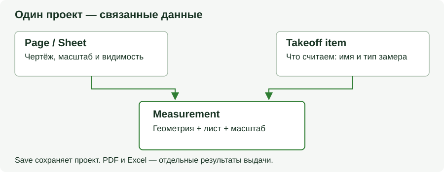

# OurPlanCore — начало работы

Руководство для **2.2.7 Preview**, проверено 6 сентября 2026. OurPlanCore связывает
чертёж, замер, takeoff и экспорт. Основная работа хранится локально; отдельные
AI-команды отправляют выбранные материалы в онлайн-сервис после запуска пользователем.

## Найти нужную инструкцию

| Хочу сделать | Открыть |
| --- | --- |
| Начать проект, открыть старый или сделать копию | [Проекты и сохранение](job-creation-storage.md) |
| Посчитать точки, длину, площадь, Joists, Beams или Openings | [Инструменты замера](ourplanecore.md#tools) |
| Настроить привязки и точно обвести контур | [Snap](ourplanecore.md#snap) |
| Перенести или отзеркалить замеры | [Выделение и редактирование](ourplanecore.md#editing) |
| Назначить свою клавишу, вернуть стандартную | [Горячие клавиши](ourplancore-shortcuts.md) |
| Понять автоматическую раскладку takeoffs | [Имена и auto-routing](takeoff-naming.md) |
| Найти скрытый менеджер или настройку | [Modules и Settings](ourplanecore.md#modules) |
| Разобраться с ошибкой, пропавшим замером или Save | [Решение проблем](ourplancore-troubleshooting.md) |
| Узнать, что изменилось в новой версии | [Изменения 5–6 сентября](ourplancore-changelog.md) |

## Первый рабочий проход

### 1. Открой или создай проект

`Main → Open / Import → Open project...` открывает общий список проектов.
Новый пустой проект: `Blank project - start empty`; новый из PDF:
`New project from a folder of PDFs...`. Укажи имя и место для `.ourplan`.
Старый папочный проект открывается в прежнем формате.

### 2. Проверь лист и масштаб

Выбери нужный лист в `Pages`. Сверь номер/ревизию с исходником. Через `Scale`
отмерь известный размер и проверь результат контрольным `Ruler`. Автоматически
найденный масштаб тоже нужно проверить: внешний вид листа не доказывает
правильность единиц и количества.

### 3. Создай takeoff

Takeoff item отвечает за **то, что считаешь**: например, Exterior wall или Roof
area. Лист отвечает за **где считаешь**. Имя и тип нового item могут включить
auto-routing; после создания проверь его место в дереве.

Для нового замера нажми инструмент: Count для количества объектов, Line для
длины или Area для площади; затем задай свойства нового takeoff и начни запись.
Чтобы продолжить **существующий** item, выбери его и включи `Record` / `Space`.
Повторное нажатие кнопки инструмента может начать создание нового item.
Beam, Openings и J Area имеют собственные параметры и расчёты; настрой их по
нужному сценарию. Геометрию строй по реальному контуру чертежа.

### 4. Проверь замер и принадлежность

Убедись, что активен нужный takeoff, выбран правильный инструмент и замер
появился на нужном листе. Один takeoff может включать замеры нескольких листов.
При вставке на другой лист выбери `Same takeoffs` или `New takeoffs` в диалоге
и проверь целевой лист. `Undo` отменяет соответствующее действие.

### 5. Подготовь результат

- **PDF:** открой `PDF Output → Preview`. Настрой толщины, подписи и легенду;
  живое превью показывает текущий лист. Для выдачи нужного набора используй
  экспорт PDF, затем открой полученный файл и проверь листы и видимые замеры.
- **Excel:** проверь книгу, лист, начальную ячейку и выбранные takeoffs перед
  записью. `Value` передаёт значения, обычный Excel export и macro actions
  выполняют другие операции. После macro actions проверь книгу и сохрани её
  в Excel; успешный экспорт не подтверждает инженерную полноту сметы.

### 6. Сохрани и проверь копию

Для `.ourplan` команда `Save` обновляет переносимый файл; для старого проекта —
данные в прежней папке. Дождись успеха перед копированием или передачей.
Если приложение сообщает только о local recovery либо об ошибке
упаковки, используй [инструкцию восстановления](job-creation-storage.md#lost).

## Что означают основные сущности

<figure markdown>
  
  <figcaption>Схема данных OurPlanCore; это пояснение связей, а не снимок интерфейса.</figcaption>
</figure>

| Сущность | Роль |
| --- | --- |
| Project / Job | Весь проект: листы, takeoffs, настройки и источники |
| Page / Sheet | Конкретный чертёж с масштабом и параметрами отображения |
| Takeoff item | Именованный контейнер замеров одного типа |
| Measurement | Конкретная геометрия, связанная с листом и масштабом |
| Annotation | Пояснение или разметка; не всякая аннотация добавляет quantity |
| PDF Preview | Проверка оформления текущего листа перед экспортом |

## Настроить под себя

`8 Settings` содержит правила и шаблоны, `Modules` — доступность дополнительных
панелей. В `Keyboard Shortcuts` можно менять назначения, включая зеркала,
сохранять общий набор и отдельный набор проекта. Стандартные клавиши продолжают
работать, пока ты их не переопределишь.

## See also

- [Полный справочник интерфейса](ourplanecore.md)
- [Workflow estimating](../start/workflow.md)
- [Проверка перед выдачей](../start/quality-checklist.md)
