# OurPlanCore

Локальная программа для takeoff по PDF — рабочее место estimator-а: PDF-viewer,
дерево листов (Pages), дерево takeoff'ов (Takeoffs), Estimating и экспорт в Excel
в одном окне. Близкий функциональный клон PlanSwift, всё **локально** (никакого
облака). Эта страница — **гайд для пользователя**: что делает каждый инструмент,
как им пользоваться и на что смотреть.

<!--
════════════════════════════════════════════════════════════════════════
СКРИНШОТЫ — ПЕРЕСНЯТЬ ИЗ ТЕКУЩЕЙ СБОРКИ v2.2.5 (Артём подложит свежие кадры).
Текст уже выверен по исходнику; скрины должны показывать именно новую версию.
  • opc-main-view.png     — 5 лент (Main·Page·Annotation·Viewport·Display, БЕЗ PDF Output),
                            строка режимов Main View/Settings, Pages слева, Takeoffs справа,
                            tool strip снизу.
  • opc-toolstrip.png     — оба ряда; кнопка Openings подписана "Open"; Record в строке НЕТ.
  • opc-ribbon-main.png   — Main: JOB (Open/Import, PlanSwift, PDF Takeoffs) + PDF (Export;
                            при вкл. Sheet Manager — Name/Scale/Name+Scale; при вкл. AI — AI Fill/Crop Hints).
  • opc-ribbon-page.png   — Page: Add / Rotate / Flip / Image / Page.
  • opc-ribbon-viewport.png — Viewport: Lines & Area, Ruler, PDF Snap Bridge.
  • opc-modules.png       — Settings→Modules: 18 модулей в 5 группах, combo пресетов + кнопки.
  • opc-pages-layers.png  — панель Pages с под-табом PDF Layers.
  • opc-takeoffs-panel.png— панель Takeoffs (item + Record, под-табы, итог снизу).
  • opc-3d.png            — вкладка 3D: Build / Rafters / Viewer (НЕ старый Massing).
  • opc-ai-manager.png    — AI Manager: Setup / Review / Batch / Markers.
  • opc-sheet-manager.png — Sheet Manager: сетка + Auto Name/Auto Scale/Name+Scale, Apply Checked.
  • opc-takeoff-manager.png — Takeoff Manager: таблица items/sections.
  • opc-materials.png     — вкладка Materials: Extract, Report Sheet, экспорт.
  • opc-report-builder.png— вкладка Report Builder: Reload TemplateCom.xlsm, Apply Walls.
  УДАЛИТЬ/НЕ ИСПОЛЬЗОВАТЬ: opc-ribbon-pdf-output.png — ленты PDF Output больше нет.
════════════════════════════════════════════════════════════════════════
-->

!!! tip "Интерфейс настраивается — по умолчанию показывается только основное"
    Программа умеет **много**, но для повседневной работы лишнее убрано. По
    умолчанию виден **основной набор**: PDF-вьюпорт с инструментами замера, деревья
    Pages/Takeoffs, Estimating, экспорт. Тяжёлые «менеджеры» (Sheet Manager,
    Takeoff Manager, Report Builder, Materials, AI, 3D) **скрыты** и включаются
    галочкой в **`Settings → Modules`** — см. [Модули](#modules). Ничего не
    удаляется: выключенный модуль просто спрятан, данные сохраняются.

!!! note "Статус и обозначения"
    Внутренняя программа, не публичный SaaS. На скриншотах скрыты job names,
    sheet names и реальные takeoff names. Названия кнопок даны **как в интерфейсе**
    (англ.), пояснение — рус.; тултипы в программе совпадают с этим. Системные пути
    (`%APPDATA%\OurPlanCore\…`, `Documents\OurPlanCore Jobs`) — это имена на диске,
    их оставляем как есть.

??? abstract "🆕 Что нового — история обновлений (нажми, чтобы раскрыть)"

    ### 07.2026 — Модульный интерфейс, Display-лента, новые инструменты

    Крупный проход: программа переименована в **OurPlanCore**, интерфейс урезан до
    основного, продвинутое вынесено в переключаемые модули.

    - **Система модулей (`Settings → Modules`).** Функционал разбит на модули с
      галочками: **Off прячет модуль везде и блокирует его команды**, данные проекта
      при этом сохраняются. По умолчанию **выключены** Sheet Manager, Takeoff
      Manager, Report Builder, Materials, AI и 3D — поэтому «из коробки» окно чистое.
      Настройка резолвится **job override → global preset → default**
      (см. [Модули](#modules)).
    - **Только две «пилюли» рабочих режимов** — `Main View` и `Settings`. Остальные
      табы-менеджеры появляются в строке **только когда включён их модуль**.
    - **Отдельная лента `Display`** — все экранные тумблеры (Labels, Legend, `Fast
      pan/zoom`, `PDF layers`, `Static image`, `Black vector`, `ft/sf`, фон вьюпорта
      и страницы, `Dark`) собраны в одну ленту, отдельно от `Viewport` (там теперь
      только толщины/заливки и PDF-Snap `Bridge`).
    - **`P Line` — точки вдоль линии.** Новый инструмент: проводишь линию →
      программа расставляет **равномерные count-метки** вдоль неё (посты, пикеты,
      hangers по шагу).
    - **`Combine ▾` — булевы операции над Area:** `Union` (объединить), `Subtract`
      (вычесть), `Intersect` (только пересечение), `Remove Overlap` (убрать двойной
      счёт), `Divide` (разбить на эксклюзивные + перекрытие).
    - **Базовое именование/масштаб листа — всегда под рукой.** Кнопки `Name` /
      `Scale` / `Name+Scale` живут внизу панели Pages и работают **без** модуля
      Sheet Manager (полный менеджер листов — уже опция).
    - **Static image page mode** (PlanSwift-style): лист можно показывать как единый
      растр (`Display → Static image`), плюс `Black vector` для чёткой чёрной
      графики. **Extra Joists** — быстрый непрерывный докид лаг (++d++ в выбранной
      Joist Area).

    ### 22.06.2026 — Обновление интерфейса: деревья, Annotation, выделение

    - **Иконки папок** в деревьях (Pages и Takeoffs): папка **закрашена**, если
      внутри есть данные (в любой вложенности), и **пустой контур**, если пусто.
    - **Чёткое выделение строк** в `Bookmarks` и `AI Inbox` (сплошная заливка как в
      деревьях, не тускнеет при потере фокуса).
    - **Аннотации** переоформлены: инструменты (`Highlight` / `Draw` / `Arrow` /
      `Box` / `Cloud` / `Area` / `Note`) с иконками; толщина (`Width`) и палитра —
      прямо в ленте.

    ### 06–15.06.2026 — Count Similar, multiline, стропила, надёжность v2

    - **Count Similar** (`Similar` рядом с `Count`): обводишь один символ → программа
      находит похожие на листе **офлайн**; порог + пресеты `Strict`/`Default`/`Loose`,
      опц. повороты/зеркало, опц. перепроверка AI, добавление одним undo-шагом.
    - **Multiline** — линия с авто-офсетами (до 2 компаньон-линий со своим именем,
      цветом, расстоянием и стороной).
    - **Символы `Count`** — полный набор из 7 (circle, cross, square, star, triangle,
      diamond, ring).
    - **Merge / Split** — перенос сегментов в другой (`Merge`, ++ctrl+m++) или в новый
      (`Split`, ++ctrl+shift+m++) takeoff.
    - **Надёжность v2:** атомарная запись `Data.xml`, **переносимый job**
      (относительные пути), повторы AI-запросов, видимые ошибки AI, авто-архив/ротация
      логов.

    ### Май–Июнь 2026 — производительность, raster, снап, 3D

    - **Viewport «молниеносно»:** coalescing render-запросов, большие RAM-кэши,
      clipped detail-тайлы (чёткий текст на высоком зуме), prefetch соседних листов.
    - **Raster-листы:** сканы и PlanSwift image-листы открываются напрямую;
      строгий snap по чёрным линиям через `raster\snap.json`.
    - **PDF contour snap** (`Area` + `PDF Snap` + ++tab++) — трассировка внешнего
      контура здания. :material-progress-wrench: в доработке.
    - **3D per-edge roof** и **3D Massing** (AI-черновик здания) — теперь модуль `3D`.
    - **F1 cheat-sheet overlay**, **Takeoff Templates dock**, **Transform popup**.

## Что видно по умолчанию { .kb-section-title .kb-st--cyan }

Экран делится на четыре зоны. Всё, что нужно для повседневного takeoff, — здесь,
без переключения режимов.

<figure markdown>
  
  <figcaption>Верхние ленты, слева <code>Pages</code>, по центру PDF-вьюпорт, справа <code>Takeoffs</code>, снизу — tool strip. Строка режимов — всего две «пилюли»: <code>Main View</code> и <code>Settings</code>.</figcaption>
</figure>

- **Сверху — ленты команд:** `Main` · `Page` · `Annotation` · `Viewport` · `Display`
  (лента `Annotation` появляется только с модулем Annotations). Под ними — строка
  режимов (`Main View` / `Settings`). Отдельной ленты `PDF Output` **нет** — экспорт
  PDF живёт кнопкой `Export` в ленте `Main` и в output-настройках.
- **Слева — `Pages`:** дерево листов и папок, под-табы `Pages` / `PDF Layers` /
  `Overlay` / `Bkm`.
- **По центру — вьюпорт:** сам чертёж с overlay замеров; вкладки открытых листов
  сверху.
- **Справа — `Takeoffs`:** дерево takeoff-папок и items, под-табы `Takeoffs` /
  `Estimating` / `Templates`, активный item + `Record`.
- **Снизу — tool strip:** инструменты замера, привязки, zoom, экспорт.

!!! info "Где остальные режимы?"
    `Sheet Manager`, `Takeoff Manager`, `Report Builder`, `Materials`, `AI Manager`
    и `3D` — **опциональные модули, выключенные по умолчанию**. Включи нужный в
    [`Settings → Modules`](#modules) — его «пилюля» появится в строке режимов.

## Что внутри { .kb-section-title .kb-st--green }

<div class="grid cards" markdown>

-   :material-file-pdf-box:{ .lg .middle .kb-mk--cyan } **PDF Workspace** · *core*

    ---

    Job, листы, папки, слои, overlay, масштаб, легенда, display-настройки,
    экспорт PDF с замерами.

-   :material-ruler-square:{ .lg .middle .kb-mk--amber } **Инструменты замера** · *core*

    ---

    `Count`, `Line`, `Area`, `J Area`, `Scale`, `Ruler` + продвинутые
    (`Beam`, `Openings`, `Cut`, `P Line`, `Similar`, `Combine`).

-   :material-folder-tree:{ .lg .middle .kb-mk--green } **Pages / Takeoffs** · *core*

    ---

    Слева листы/папки, справа takeoff folders/items. Выбор листа подсвечивает
    его замеры, и наоборот.

-   :material-chart-box-outline:{ .lg .middle .kb-mk--blue } **Estimating / Excel** · *core*

    ---

    Табличный обзор quantities, sections, units, notes, prices; экспорт CSV/TXT/
    Excel и запись в **уже открытый** workbook.

-   :material-tune-variant:{ .lg .middle .kb-mk--orange } **Modules** · *core*

    ---

    `Settings → Modules` — что показывать. Основное включено, продвинутое —
    по желанию (job / global / default).

-   :material-cube-outline:{ .lg .middle .kb-mk--violet } **Менеджеры и AI/3D** · *опция*

    ---

    Sheet Manager, Takeoff Manager, Report Builder, Materials, AI, 3D — модули
    **off by default**, включаются в Settings.

</div>

## От и до — рабочий процесс { .kb-section-title .kb-st--green }

Короткий маршрут от пустого экрана до экспорта на **основном** наборе функций.

1. **Создать / открыть job.** Лента `Main` → `Open / Import` (++ctrl+o++) —
   открыть/создать job или импортировать PDF. Недавние — ++ctrl+shift+o++.
2. **Импорт PDF.** `Open / Import` → добавить PDF (или лента `Page` → `Add Pages`).
   В окне импорта решаешь, строить ли **растровый кэш + snap** (см. [Создание job](#job)).
3. **Разложить листы.** Слева `Pages` → `+ New` (папки) / `Auto Folders`; порядок
   — перетаскиванием. Имя и масштаб листа — кнопками `Name` / `Scale` / `Name+Scale`
   внизу панели (или ++f5++ / ++f4++).
4. **Открыть лист.** Клик по листу в дереве `Pages`. Проверить масштаб (`Scale`) и
   при необходимости слои (`PDF Layers`).
5. **Создать / выбрать takeoff item.** Дерево `Takeoffs` справа → `New Item`
   (или ++t++). Имя — по [правилам naming](takeoff-naming.md).
6. **Рисовать.** Выбрать tool (`Count`/`Line`/`Area`/`J Area`), включить `Record`
   (++space++), обвести. Для `Line`/`Area` обязателен `Scale`. Включи **привязки**
   (`Snap`/`PDF Snap`) — линии лягут точно по чертежу (см. [Привязки](#snap)).
7. **Проверить.** Под-таб `Estimating` (справа) или `Open Estimating` — totals,
   sections, notes; `Current-sheet filter` — только активный лист.
8. **Экспорт.** `Export` (в дереве Takeoffs) → `CSV` / `TXT` / `Excel`, либо
   `Current Excel` — пишет в **уже открытый** workbook от активной ячейки
   (auto-save **нет**).

!!! tip "Нужно больше?"
    Массовое переименование/масштабирование листов по PDF-метаданным, таблица-обзор
    всех takeoff'ов, отчёты, материалы, AI-подсказки, 3D — всё это **модули**.
    Включи в [`Settings → Modules`](#modules) и загляни в
    [Опциональные модули](#optional).

## Создание job, папок и что появляется автоматически { #job .kb-section-title .kb-st--orange }

**Job — это одна папка на диске.** Всё внутри: исходные PDF, листы, takeoff'ы,
AI-контекст, настройки. Ничего в облаке. Скопировал/забэкапил папку — сохранил всю
работу.

### Создать / открыть job

Всё начинается с `Open / Import` (++ctrl+o++). Меню: секция **OPEN A JOB**
(`Recent jobs...`, `Open a job from a folder...`) и секция **CREATE A NEW JOB**:

| Пункт | Что происходит |
| --- | --- |
| `New job from a folder of PDFs...` | Указываешь папку → программа ищет `*.pdf` рекурсивно, просит имя job и **сразу импортирует все PDF**. |
| `Blank job - start empty, add sheets later` | Пустой job без листов. Листы добавишь потом (`Add Pages`, `Blank Sheet`). |
| `Import PDF Takeoffs...` | Импорт PDF **вместе с замерами-аннотациями** как редактируемые takeoff'ы. Сначала превью, файлы — после подтверждения. |
| `Sample job (demo to explore)` | Демо-job `OurPlanCore Guide Sample` — потрогать интерфейс без своих данных. |

!!! note "PlanSwift — не в меню создания job'а"
    Конвертация PlanSwift → отдельным job'ом делается кнопкой `PlanSwift` в ленте
    `Main` (исходник открывается только на чтение). Добавить PlanSwift **в открытый**
    job — через `Open / Import → Import into the current job → PlanSwift project...`.
    Полный разбор импорта — [Создание Job](job-creation-storage.md).

### Добавить листы и папки в открытый job

- **Листы:** лента `Page` → `Add Pages` (импорт PDF) · `Blank Sheet` (пустой лист
  `36"×24"`) · `PDF Takeoffs` (PDF + аннотации).
- **Page-папки:** слева `+ New` → `New Folder` вручную · `Auto Folders` —
  стандартный набор папок по шаблону. Шаблон — переключатель `Folder template`
  (`Auto` / `COM` / `EWP`).
- **Takeoff-папки:** справа `New Folder` вручную · через `More ▾` — `Auto Tree`
  (стандартное дерево секций) и `From Pages` (дерево из структуры листов) ·
  `Templates` — развернуть сохранённую заготовку (см. [docks](#docks)).

!!! tip "Растровый кэш при импорте — ставить галочку или нет"
    При импорте PDF выскакивает `Import PDF Options` с галкой **«Build readable
    raster cache and strict black-line snap index»**:

    - **Включена** → лист «запекается» в картинку (150 DPI, «Raster First») + строится
      **snap-индекс по чёрным линиям** → тяжёлые PDF **быстрее открываются** и
      доступна **точная привязка к линиям чертежа**. Цена — время импорта и место на
      диске (`<лист>\raster\`).
    - **Выключена** → импорт быстрее, без лишних файлов, но строгий snap к чёрным
      линиям недоступен.

    Оригинал PDF всегда остаётся источником — растр это только кэш поверх.

### Что создаётся на диске автоматически

```text
<job>\
├─ Data.xml        ← карточка job (имя, тип, GUID)         [авто]
├─ sources\        ← КОПИИ всех исходных PDF                [авто при импорте]
├─ Pages\          ← ЛИСТЫ; один лист = одна папка          [авто]
│   └─ 00. imported\<лист>\
│         ├─ source.json     ← ★ главный файл листа (путь к PDF, № стр., scale)
│         ├─ Data.xml        ← видимое имя листа и порядок
│         └─ raster\         ← растр-кэш + snap.json (если ставил галку)
├─ Takeoffs\       ← TAKEOFF'ы; один item = одна папка       [авто]
│   └─ <item>\
│         ├─ Data.xml          ← цвет, тип, цена, notes
│         └─ measurements.json ← ★ вся геометрия замеров
└─ AI_Context\     ← AI-наблюдения, кропы, запросы, settings\ [авто]
```

!!! warning "Имя папки ≠ видимое имя; не трогать руками"
    На диске имя «причёсано» и уникально, человекочитаемое — в `Data.xml`.
    Не переименовывай и не двигай файлы внутри job проводником, не правь пути в
    `source.json`. Если после копирования job'а takeoff'ы не видны — `Repair Links`
    (в меню Pages). Полный разбор хранения —
    [Создание Job и хранение](job-creation-storage.md).

## Инструменты замера { #tools .kb-section-title .kb-st--amber }

Логика одна: **выбрал tool → выбрал активный takeoff item → включил `Record`
(++space++) → рисуешь во вьюпорте.** Результат сразу падает в quantity активного
item. Ниже — каждый инструмент подробно.

<figure markdown>
  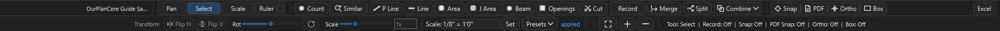
  <figcaption>Tool strip, ряд 1: <code>Pan/Select/Scale/Ruler</code> · <code>Count/Similar/P Line/Line/Area/J Area/Beam/Open/Cut</code> · <code>Merge/Split/Combine</code> · <code>Snap/PDF/Ortho/Box</code>, справа — <code>Excel</code>. Ряд 2 — <code>Transform</code> (Flip H/Flip V/Rot/Scale), настройка масштаба (<code>Set</code>/<code>Presets</code>) и <code>Fit/+/−</code>. Кнопка Openings подписана <code>Open</code>. <code>Record</code> тут нет — он на правом Active-Takeoff баре (++space++).</figcaption>
</figure>

**Шпаргалка по всем инструментам:**

| Инструмент | Клавиша | Даёт | Нужен Scale | Модуль |
| --- | --- | --- | --- | --- |
| `Pan` | ++v++ | — (навигация) | — | core |
| `Select` | ++e++ | — (правка) | — | core |
| `Scale` | ++s++ | масштаб листа | — | core |
| `Ruler` | ++r++ | временный размер | ✔ | Annotations |
| `Count` | ++p++ | `ea` | ✘ | core |
| `Line` | ++l++ | `lf` | ✔ | core |
| `Area` | ++a++ | `sf` | ✔ | core |
| `J Area` | ++j++ | `ea` + `lf` | ✔ | Advanced |
| `Similar` | — | `ea` | ✘ | Advanced |
| `P Line` | — | `ea` | ✔* | Advanced |
| `Beam` | ++b++ | `ea` + `lf` | ✔ | Advanced |
| `Openings` | ++o++ | `ea` (+ размер) | ✔ | Advanced |
| `Cut` | ++x++ | вырез/стирание | — | Advanced |
| `Combine` | — | булевы над Area | — | Advanced |

<small>*P Line берёт масштаб у исходной линии.</small>

### Навигация и калибровка { .kb-st--cyan }

=== "Pan — панорама (V)"

    **Что:** двигать вид, ничего не рисуя.
    **Как:** ++v++ → зажать левую кнопку и тащить. **Правая кнопка панорамирует
    всегда**, даже когда активен другой инструмент, — не обязательно переключаться на
    `Pan`, чтобы подвинуть чертёж.
    **Совет:** колесо — зум (шаг настраивается в `Settings → Defaults`); ++f++ —
    вписать лист целиком.

=== "Select — выбор и правка (E)"

    **Что:** выбирать и **редактировать** уже нарисованные замеры прямо на листе.
    **Как:** ++e++ → клик по объекту, рамкой — несколько; ++ctrl++ добавить/снять,
    ++alt++ — режим **вершин** (тащишь ручки), ++delete++ — удалить. Полный список
    жестов — в разделе [Редактирование](#editing).
    **Совет:** ++ctrl+m++ / ++ctrl+shift+m++ — `Merge` / `Split` выделенных
    сегментов; `Combine ▾` — булевы операции над выбранными Area.

=== "Scale — масштаб (S)"

    **Что:** задать/проверить масштаб листа — сколько реальных футов в точке PDF.
    **Обязателен до `Line` / `Area` / `J Area`** (без него запись линейных/площадных
    замеров блокируется).
    **Как:** ++s++ → провести по объекту **известного размера** (лучше по
    dimension-линии чертежа) → ввести реальную длину. Или задать пресетом:
    `Set` / `▾ Presets` в нижней панели.
    **Хранение:** scale держится **per page** *и* **per measurement** — поэтому один
    takeoff item может идти по нескольким листам с разными масштабами, а при переносе
    замера на другой лист длина пересчитывается корректно.
    **Совет:** включи `Ortho` (++f8++), когда калибруешься по горизонтальному/
    вертикальному размеру, — линия ляжет ровно и цифра будет точной.

=== "Ruler — линейка (R)"

    **Что:** быстро замерить расстояние на лету, **не создавая** takeoff item.
    **Как:** ++r++ → провести по чертежу; показывается длина. В quantity ничего не
    пишется — это просто «прикинуть размер».
    **Когда:** проверить зазор, ширину комнаты, шаг — там, где заводить отдельный
    замер не нужно.
    **Модуль:** `Annotations` (если модуль выключен, `Ruler` скрыт).

### Основные замеры { .kb-st--green }

=== "Count — счёт (P) → ea"

    **Что:** счётные маркеры поштучно — окна, двери, посты, светильники, hardware.
    **Как:** ++p++ → клик по каждому объекту. Каждый клик = `+1 ea`.
    **Фишка:** работает **без scale** (это просто счёт).
    **Символы:** 7 форм — circle, cross, square, star, triangle, diamond, ring;
    символ/цвет задаются **у item** (диалог `New Item` / свойства) и видны одинаково
    на холсте, в легенде, дереве и PDF-экспорте. У уже выбранных меток символ меняется
    через `Count Display`; выбранный дефолт запоминается между сессиями.
    **Совет:** промахнулся — переключись на `Select` (++e++) и перетащи метку грипом
    или удали ++delete++.

=== "Line — линия (L) → lf"

    **Что:** линейные замеры — стены, plates, blocking, трим, railings, бордюр.
    **Как:** ++l++ → клик по точкам ломаной, ++c++ завершить (++backspace++ —
    отменить последнюю точку). Длина = сумма отрезков × scale.
    **Требует `Scale`.**
    **Точность:** `Snap` (++f3++) цепляет твои же точки, `PDF Snap` (++ctrl+f3++) —
    углы/пересечения чертежа, `Ortho` (++f8++) держит строго 90°/45°
    (см. [Привязки](#snap)).
    **Совет:** для стены с двумя гранями (наруж./внутр.) есть **Multiline** — до 2
    компаньон-линий с собственным именем, цветом, отступом и стороной (диалог
    `New Item`, тип `Line`, секция «Offset lines»).

=== "Area — площадь (A) → sf"

    **Что:** площади — sheathing, кровля/перекрытие, плита, drywall, покрытия.
    **Как:** ++a++ → обвести полигон, ++c++ замкнуть. Площадь = shoelace по вершинам.
    ++f9++ — прямоугольный (box) режим. **Требует `Scale`.**
    **Проёмы:** `Cut` (++x++) вырезает дырки, чтобы `sf` считалась без них.
    **Внешний контур здания:** `PDF Snap` + ++tab++ — трассировка footprint'а без
    ручного клика каждого угла (см. [Привязки](#snap)).
    **Совет:** пересекаются несколько площадей — не считай дважды: выдели их и
    `Combine ▾ → Remove Overlap`.

=== "J Area — раскладка лаг (J) → ea + lf"

    **Что:** joist/rafter layout — сразу и **количество** элементов, и **суммарная
    длина**, с направлением, шагом (spacing), pitch и округлением по пиломатериалу.
    **Как:** ++j++ → обвести область и задать **направление** раскладки → программа
    расставляет joist по шагу и считает count + LF. Лейблы видны по умолчанию.
    **Extra Joists:** выдели готовую Joist Area и жми ++d++ — **непрерывный докид**
    одиночных лаг (double/triple, добор у проёма); ++d++ ещё раз или ++esc++ — выйти.
    **Когда:** перекрытия, стропильные поля, где нужен и счёт, и погонаж за один
    проход.

### Продвинутые инструменты { .kb-st--magenta }

Все — из модуля **Advanced Takeoff Tools** (включён по умолчанию, отключается в
[Modules](#modules)).

=== "Similar — авто-счёт похожих (ea)"

    **Что:** находит **одинаковые символы** на листе по одному образцу — окна,
    двери, розетки, hardware — **офлайн**, без интернета.
    **Как:** `Similar` → обведи рамкой **один** символ → программа подсвечивает
    похожие:

    - **порог** (ползунок) + пресеты `Strict` / `Default` / `Loose`; счётчик
      «N strong, M weak» обновляется вживую;
    - цвет превью: **синие** = надёжные (прошли порог), **оранжевые** = слабые
      (на проверку), **серая галка** = уже посчитано в этом Count;
    - опц. галки **поворота** 90/180/270° и **зеркала** — ловит развёрнутые символы;
    - опц. **перепроверка AI** (только при заданном OpenAI-ключе) — кроп уходит в
      `AI Inbox`;
    - `Add` — метки добавляются **одним undo-шагом** в активный Count-item или в новый
      `Similar Count`.

    **Ограничение:** v1 — только **текущий** лист, по чёрно-белому контуру.

=== "P Line — точки вдоль линии (ea)"

    **Что:** ставит **равномерные count-метки вдоль уже нарисованной линии** — посты,
    пикеты, стойки забора, hangers, крепёж по шагу. Не рисует новую линию, а
    «раскладывает» точки по существующим.
    **Как:** инструментом `Select` выдели одну или несколько **Line**-замеров (или
    ПКМ по Line-takeoff в дереве) → `P Line` → в диалоге задай **имя**, **шаг в
    дюймах** (по умолчанию = шаг линии или `16"`) и галку **`Include line end
    point`** → `Create`. Создаётся **отдельный Count-item** «… Count Points» в той же
    папке, метки — вдоль линии.
    **Совет:** сначала нарисуй трассу как `Line` с нужной длиной, потом конвертируй —
    получишь и погонаж, и точный счёт стоек за один шаг.

=== "Beam — балка (ea + lf)"

    **Что:** замер балки «в одно действие»: меряешь длину — программа **сама создаёт
    Count-item**, именует его по длине и ставит **первую** count-метку.
    **Как:** ++b++ → провести по балке → подтвердить имя item. Дальше можно доставлять
    метки обычным `Count`. Удобно для beam / header / GLB: и длина посчитана, и
    контейнер заведён.

=== "Openings — проёмы (ea)"

    **Что:** обмер проёма рамкой: программа меряет его **`Ш×В` в футах**, создаёт
    **size-only Count-item** с именем-размером (напр. `3.0x5.0`) и ставит метку
    **в центре** проёма.
    **Как:** ++o++ → растянуть бокс по проёму → подтвердить (имя по умолчанию = размер,
    правится). Для окон/дверей/beam-openings, когда нужен и счёт, и типоразмер.

=== "Cut — вырез / стирание (X)"

    **Что:** двойного назначения — **вырезает дырки в Area** (проёмы из площади, чтобы
    `sf` считалась без них) **или стирает куски Line**.
    **Как:** ++x++ → обвести вырез внутри площади (или участок линии). ++f9++ —
    прямоугольный (box) режим. Вырез можно вставлять и за границей Area; paste
    якорится по верхнему-левому углу.

=== "Combine — булевы над Area"

    **Что:** операции над **2+ выделенными** Area-замерами:

    - `Union` — объединить в одну площадь;
    - `Subtract` — из первой выделенной вычесть остальные;
    - `Intersect` — оставить только общее пересечение;
    - `Remove Overlap` — срезать перекрытия, чтобы ничего не считалось дважды
      (побеждает первая выделенная);
    - `Divide` — разбить на эксклюзивные части + отдельную площадь перекрытия.

    **Как:** `Select` → выдели ≥2 Area → `Combine ▾` → операция.
    **Когда:** навёл несколько площадей внахлёст и нужно убрать двойной счёт или
    получить чистые непересекающиеся куски.

!!! note "Core vs Advanced — что всегда под рукой"
    `Pan`, `Select`, `Scale`, `Count`, `Line`, `Area` — **core**, доступны всегда.
    `J Area`, `Similar`, `P Line`, `Beam`, `Openings`, `Cut`, `Combine`, а также
    `Merge`/`Split` — модуль **Advanced Takeoff Tools**; `Ruler` и аннотации — модуль
    **Annotations**. Оба включены по умолчанию, но их можно выключить в
    [Modules](#modules) — тогда соответствующие кнопки просто исчезнут с панели.

## Привязки (Snap) — как точно рисовать линии { #snap .kb-section-title .kb-st--blue }

Привязки — главное, что отличает аккуратный takeoff от «на глаз». Когда snap
включён, курсор **прилипает** к характерным точкам чертежа, и вершина ставится
**ровно** туда.

| Привязка | Клавиша | К чему прилипает | Когда работает |
| --- | --- | --- | --- |
| `Snap` | ++f3++ | Endpoints / midpoints / intersections **твоей** геометрии | Всегда |
| `PDF Snap` | ++ctrl+f3++ | **Vector**-PDF: углы, концы, пересечения линий чертежа | Если PDF векторный |
| `PDF Snap` (raster) | ++ctrl+f3++ | **Строгие чёрные линии** растрового чертежа (`raster\snap.json`) | Если строил растр-кэш |
| `Ortho` | ++f8++ | Угол **90° / 45°** (или зажми ++shift++) | Line / Area / Scale |
| `Box` | ++f9++ | Прямоугольный режим (рамкой) | Area / выбор |

### Как это помогает

- **Концы линий садятся в углы** → длина считается по реальным точкам.
- **Площади замыкаются без щелей** → корректный `sf` без артефактов.
- **Стыковка замеров между собой** (`Snap`, ++f3++) → стены без нахлёста и разрыва.
- **Прямые углы** (`Ortho`, ++f8++) → ровные стены даже на дрожащей руке.
- **Строгий snap по чёрным линиям (raster)** → выручает на сканах и image-PDF.

### Трассировка контура (Area + PDF Snap → `Tab`)

1. Включи `PDF Snap`, возьми `Area`.
2. Наведись у внешней стены и жми ++tab++ — программа предлагает **контур**
   (приоритет footprint'у, мостит разрывы через окна, отсекает внутренние двери).
3. ++tab++ ещё раз — следующий вариант. Подходящий — принять.

!!! warning "Контур-снап — в доработке"
    На реальных листах автоконтур пока не всегда идеален. Если результат кривой —
    добери углы вручную обычным `PDF Snap`.

## Редактирование: выделение, vertex-grips, cut { #editing .kb-section-title .kb-st--magenta }

Инструмент `Select` (++e++) — прямое редактирование геометрии во вьюпорте.

??? note "Жесты выделения и правки вершин"

    | Жест | Что делает |
    | --- | --- |
    | Клик по объекту | Выбрать один measurement |
    | Box (рамка) | Выбрать пересечённые/охваченные |
    | ++ctrl++ + клик | Добавить в мульти-выбор / toggle |
    | ++ctrl+shift++ + клик | Убрать из выбора |
    | ++alt++ + клик/box | Режим **вершин (handles)** |
    | Drag ручки | Двигать вершину(ы); ++shift++ — ортогонально |
    | ++delete++ | Удалить объекты или ручки |
    | ++ctrl+m++ / ++ctrl+shift+m++ | Merge / Split выделенных сегментов |

- **Direct vertex grips** — ручки прямо у выбранного measurement; count-маркеры тоже
  редактируются грипами.
- **Line cut / Area cut** — разрез линии или вырез в площади на месте (++x++).

## Ленты команд (ribbons) { .kb-section-title .kb-st--cyan }

Верхняя полоса — пять лент (`Main` · `Page` · `Annotation` · `Viewport` · `Display`).
Основные — `Main`, `Page`, `Display`.

??? note "Лента `Main` — job и экспорт"

    | Кнопка | Действие |
    | --- | --- |
    | `Open / Import` | Открыть job, сменить папку, создать job или импортировать PDF |
    | `PlanSwift` | Отдельный конвертер PlanSwift-проекта |
    | `PDF Takeoffs` | Импорт PDF с замерами-аннотациями |
    | `Export` | Экспорт выбранных/всех листов в PDF |

    *С включённым модулем Sheet Manager здесь дополнительно появляются
    `Name` / `Scale` / `Name+Scale`, с модулем AI — `AI Fill` / `Crop Hints`.*

    <figure markdown>
      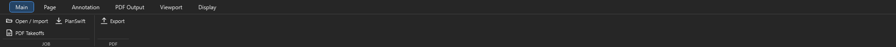
      <figcaption>Лента <code>Main</code> (дефолт): Open/Import, PlanSwift, PDF Takeoffs, Export.</figcaption>
    </figure>

??? note "Лента `Page` — работа со страницей"

    | Группа | Кнопки |
    | --- | --- |
    | `Add` | `Add Pages`, `Blank Sheet`, `PDF Takeoffs` |
    | `Rotate` | `Left`, `Right`, `180`, `Level`, `Batch Rotate` |
    | `Flip` | `Vertical`, `Horizontal` |
    | `Image` | `Invert`, `Copy` (PNG в буфер), `Crop New Page` |
    | `Page` | `Batch Rename`, `Set Origin`, `Offset Origin`, `Close Page` |

    <figure markdown>
      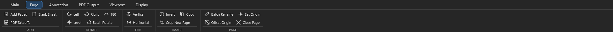
      <figcaption>Лента <code>Page</code>: Add, Rotate, Flip, Image, Page.</figcaption>
    </figure>

??? note "Лента `Viewport` — толщины и заливки на экране"

    **`Viewport`** — как выглядят замеры **на экране** (толщины/заливки) + PDF-Snap:

    | Группа | Контрол | Действие |
    | --- | --- | --- |
    | `Lines & Area` | `Line` / `Point` / `Edge` / `Fill` | Толщина линий, размер маркеров, граница и заливка площади (`Fill` — %) |
    | `Ruler` | `Ruler` (width) | Толщина линейки |
    | `PDF Snap` | `Bridge` | Радиус «мощения» разрывов при контур-снапе (++tab++) |

    <figure markdown>
      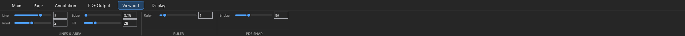
      <figcaption>Лента <code>Viewport</code>: Lines &amp; Area, Ruler, PDF Snap Bridge.</figcaption>
    </figure>

??? note "Output-настройки экспорта PDF (не лента)"

    Отдельной ленты `PDF Output` нет. То, **как замеры/markups лягут в экспортный
    PDF**, задаётся в **output-настройках** (модуль **PDF Output**), а сам экспорт —
    кнопкой `Export` в ленте `Main`:

    | Контрол | Действие |
    | --- | --- |
    | `Lines & Area` ползунки | Толщина/заливка в экспорте |
    | `Labels` | Какие value-лейблы включать |
    | Overlays `Legend` / `Header` | Легенда / заголовок масштаба |
    | `Include` `Meas` / `Markups` | Включать замеры / аннотации |

    *Выключишь модуль PDF Output — кнопка `Export` и эта вкладка настроек пропадут.*

??? note "Лента `Display` — что показывать на экране"

    Все экранные тумблеры собраны здесь:

    | Группа | Контролы |
    | --- | --- |
    | `Labels` | `All` / `Line` / `Area` / `Joist` / `Count`; `w/ page` (лейблы масштабируются со страницей) |
    | `Legend` | `Show` / `Size` / `Pos` / `w/page` |
    | `Header` | `w/page` |
    | Рендер | `Fast pan/zoom`, `PDF layers`, `Static image` (лист как единый растр), `Black vector` (чёткая чёрная графика) |
    | Единицы | `ft / sf` (Imperial) |
    | Фон/тема | фон вьюпорта, фон страницы, `Dark` |

??? note "Лента `Annotation` — разметка поверх листа"

    Кнопка `Annotation ▾` открывает набор: `Highlight` / `Draw` / `Arrow` / `Box` /
    `Cloud` / `Area` / `Note`. Толщина (`Width`) и цвет — прямо в ленте.
    Аннотации — это разметка **поверх** чертежа, не quantity. **Модуль:**
    `Annotations`.

## Панели Pages / Takeoffs { .kb-section-title .kb-st--magenta }

Слева — листы (`Pages`), справа — что считаешь (`Takeoffs`). Выбор листа
подсвечивает его замеры, и наоборот.

??? note "Левая панель `Pages`"

    | Контрол | Действие |
    | --- | --- |
    | `Open ▾` / `Tile M2` | Открыть лист(ы) вкладками / в отдельных окнах / тайлинг на мониторе 2 |
    | `Folder template` (`Auto`/`COM`/`EWP`) | Шаблон авто-папок для sheets |
    | `+ New ▾` | `New Folder`, `Blank Sheet`, `Auto Folders` |
    | `Setup ▾` | `Name / Scale…`, сортировки `A/S` и `D/Sec/WT`, `Repair page links` |
    | Под-табы | `Pages` (дерево) · `PDF Layers` · `Overlay` (наложить лист на лист) · `Bkm` (bookmarks) |
    | Низ панели | `New Folder` · `Name` · `Scale` · `Name+Scale` — базовое именование/масштаб листа (без модуля Sheet Manager) |

    <figure markdown>
      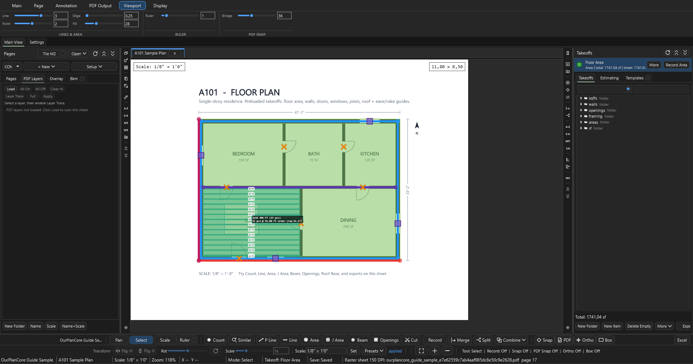
      <figcaption>Панель <code>Pages</code> с открытым под-табом <code>PDF Layers</code>: Load / All On / All Off / Clear Hi / Layer Trace / Apply.</figcaption>
    </figure>

??? note "Правая панель `Takeoffs`"

    | Контрол | Действие |
    | --- | --- |
    | Карточка item + `Record` | Активный item и вкл/выкл запись (++space++) |
    | `More ▾` | Свойства, поиск, навигация по листам/items, `Auto Tree` / `From Pages` |
    | Под-табы | `Takeoffs` (дерево) · `Estimating` (таблица) · `Templates` (заготовки) |
    | Низ панели | `New Folder` · `New Item` · `Delete Empty` · `More ▾` · `Export ▾` |

    <figure markdown>
      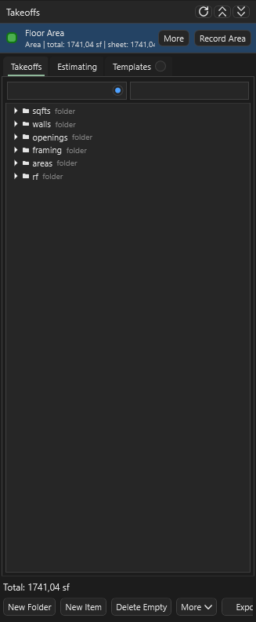
      <figcaption>Панель <code>Takeoffs</code>: активный item + Record, под-табы, дерево, итоговая сумма снизу.</figcaption>
    </figure>

### Bookmarks · Templates · docks { #docks }

- **Page Bookmarks** (под-таб `Bkm`) — сохранённый **вид листа** (страница + zoom/
  позиция). `Add` (++b++ ++k++) сохранить, `Enter`/двойной клик — вернуться.
- **Takeoff Templates** (под-таб `Templates`) — переиспользуемое **дерево takeoff-
  папок/итемов**. `Save Current` сохранить структуру, `Apply` развернуть на новом job.

!!! tip "Bookmark vs Template — не путать"
    - **Bookmark** = *куда смотреть* (лист + zoom).
    - **Template** = *что считать* (заготовка дерева takeoff).

## Estimating и экспорт { .kb-section-title .kb-st--blue }

Под-таб `Estimating` (или `Open Estimating`) — табличный обзор quantities по
sections, с units, notes и ценами. `Current-sheet filter` показывает только
активный лист.

| Export | Статус | Для чего |
| --- | --- | --- |
| CSV | ✅ | Табличный output: quantities, notes, scale, price |
| TXT | ✅ | PlanSwift-like text blocks |
| Excel `.xlsx` | ✅ | Rows в стиле `Name / Value / Unit` |
| `Current Excel` | ✅ | Пишет selected rows в **уже открытый** workbook от active cell |

!!! warning "`Current Excel` не делает auto-save"
    Программа пишет строки, **проверка и save — на пользователе**. By design.
    Notes экспортируются; multi-select поддерживает move/copy/cut/paste/delete.

## Modules — что показывать { #modules .kb-section-title .kb-st--orange }

`Settings → Modules` — единственное место, где включается/выключается функционал.
**Off прячет модуль везде и блокирует его команды; сохранённые данные проекта
остаются.** Так интерфейс держится чистым: основное включено, продвинутое — по
желанию.

<figure markdown>
  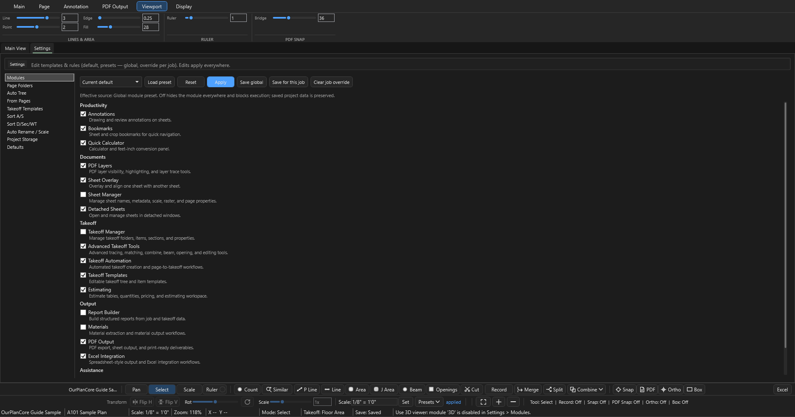
  <figcaption><code>Settings → Modules</code>: категории Productivity / Documents / Takeoff / Output / Assistance; галочки + Load preset / Reset / Apply / Save global / Save for this job / Clear job override.</figcaption>
</figure>

| Категория | Модуль | По умолчанию |
| --- | --- | --- |
| Productivity | **Annotations** — разметка поверх листа, `Ruler` | ✅ вкл |
| Productivity | **Bookmarks** — bookmarks листов и кропов | ✅ вкл |
| Productivity | **Quick Calculator** — калькулятор + фт-дюймы | ✅ вкл |
| Documents | **PDF Layers** — слои PDF, highlight, layer trace | ✅ вкл |
| Documents | **Sheet Overlay** — наложение листа на лист | ✅ вкл |
| Documents | **Detached Sheets** — листы в отдельных окнах, `Tile M2` | ✅ вкл |
| Documents | **Sheet Manager** — менеджер имён/масштаба/метаданных листов | ⬜ **выкл** |
| Takeoff | **Advanced Takeoff Tools** — Similar, P Line, J Area, Beam, Openings, Cut, Merge/Split/Combine | ✅ вкл |
| Takeoff | **Takeoff Automation** — Auto Tree / From Pages / Auto Folders | ✅ вкл |
| Takeoff | **Takeoff Templates** — заготовки дерева/итемов | ✅ вкл |
| Takeoff | **Estimating** — таблица quantities, цены | ✅ вкл |
| Takeoff | **Takeoff Manager** — таб-менеджер папок/итемов/секций | ⬜ **выкл** |
| Output | **PDF Output** — экспорт PDF | ✅ вкл |
| Output | **Excel Integration** — Excel/Current Excel | ✅ вкл |
| Output | **Report Builder** — сборка отчётов | ⬜ **выкл** |
| Output | **Materials** — извлечение материалов | ⬜ **выкл** |
| Assistance | **AI** — AI Inbox, маркеры, review-workflow | ⬜ **выкл** |
| Assistance | **3D** — 3D-модель, massing, roof/wall/framing | ⬜ **выкл** |

!!! info "Как разрешается настройка (порядок приоритета)"
    **Job override → Global preset → Default.**

    - `Apply` — применить **прямо сейчас, но не сохраняя** (в статусе будет
      «Live Apply (not saved)»); переживёт до перезапуска только после Save.
    - `Save global` — сделать набор глобальным дефолтом
      (`%LOCALAPPDATA%\OurPlanCore\presets\modules.json`).
    - `Save for this job` — override только для открытого job
      (`<job>\AI_Context\settings\modules.json`).
    - `Clear job override` — снять job-override, вернуться к global/default.
    - `Reset` — сброс к встроенным дефолтам.
    - `Load preset` — загрузить набор из combo: `Current default` / `All modules on` /
      `Takeoff Only` / `Minimal`.

    Здесь же — редакторы других правил (Page Folders, Auto Tree, From Pages,
    Takeoff Templates, Sort A/S, Sort D/Sec/WT, Auto Rename/Scale, Project Storage,
    Defaults) с той же логикой job/global/default.

## Опциональные модули { #optional .kb-section-title .kb-st--violet }

Всё ниже **выключено по умолчанию** — включается в [`Settings → Modules`](#modules).
После включения соответствующая «пилюля» появляется в строке режимов.

??? note ":material-table-edit: Sheet Manager — метаданные листов"

    Таблица всех листов с массовыми операциями: `Analyze` → `Auto Name` /
    `Auto Scale` / `Name+Scale` (review-gated) → проверить `Confidence` / `Why` /
    `Warnings` → `Apply Checked` (применяется **только** отмеченное). Нет данных в
    PDF → `AI Fill` (нужен модуль AI). Плюс `Import PDF(s)`, `Export PDF`,
    `Sort A/S`, `D/Sec/WT`, `Repair Links`, `Auto Folders`, raster DPI.

    <figure markdown>
      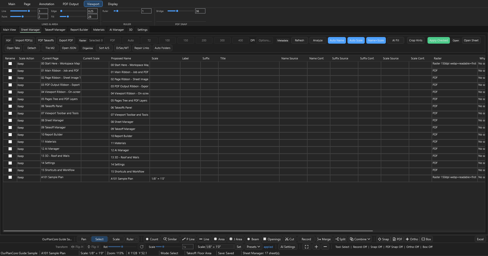
      <figcaption><code>Sheet Manager</code>: сетка листов, Auto Name / Auto Scale / Name+Scale, Apply Checked.</figcaption>
    </figure>

??? note ":material-format-list-checks: Takeoff Manager — таблица takeoff'ов"

    Полный таб-обзор quantities, sections, notes, цен по всем takeoff'ам с
    сортировкой и экспортом — расширение под-таба `Estimating` на весь экран.

    <figure markdown>
      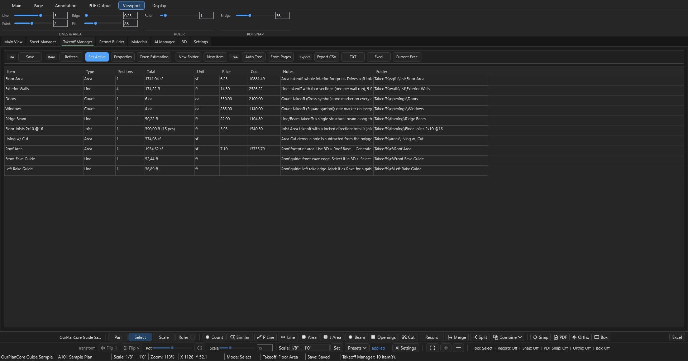
      <figcaption><code>Takeoff Manager</code>: таблица items/sections, quantities, экспорт.</figcaption>
    </figure>

??? note ":material-cube-outline: 3D — per-edge roof и rafters"

    Строит 3D из takeoff'ов: стены-призмы из `Line`, roof footprint из `Area`,
    крыша — по углу каждой кромки. Живой рабочий поток (лента-тулбар вкладки `3D`,
    группы **Build / Rafters / Viewer**):

    1. **Build** → `Roof Base` — footprint из выбранного area-takeoff. (`Auto` /
       `Wall` — авто/ручная сборка стен.)
    2. `Select Edge` — помечаешь кромки на листе; в боковой панели каждой кромке
       задаёшь `Pitch` (+ `Overhang in`) или галку `Defines Slope (eave)` и жмёшь
       `Save Edge(s)`. Дефолтный уклон — `6/12`.
    3. `Generate Roof` — солвер строит ridge / hips / **valleys** из сохранённых
       per-edge уклонов; результат можно затолкнуть обратно в takeoff-дерево
       (`Roof Takeoff` / `Roof Qty`).
    4. **Rafters** → `Pick Faces` (кликаешь грани) или `Whole Roof`; `Spacing`
       (`12"` / `16"` / `19.2"` / `24"`) + `Size` (дефолт `2x10`) → count + LF с
       поправкой на уклон.
    5. **Viewer** — `Fit` / `Iso` / `Top` / `Front` / `Reset`.

    Клавиши guide-режима крыши: ++r++ Ridge · ++h++ Hip · ++v++ Valley · ++e++ Eave ·
    ++k++ Rake · ++p++ Pitch.

    <figure markdown>
      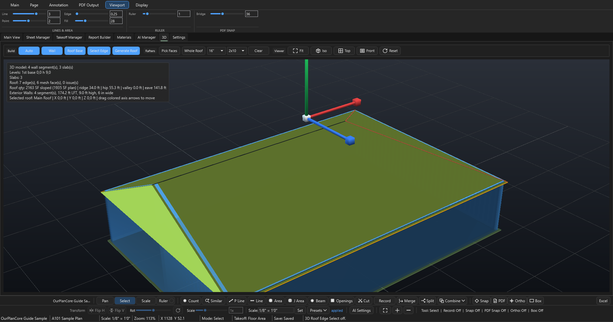
      <figcaption><code>3D</code>: Build (Auto / Wall / Roof Base / Select Edge / Generate Roof) + Rafters (Pick Faces / Whole Roof / Spacing / Size) + Viewer (Fit/Iso/Top/Front/Reset).</figcaption>
    </figure>

    !!! warning "Старый «3D Massing» отключён"
        Прежний AI-черновик здания (`Build 3D Draft`, `3D From Takeoffs`,
        `Review Roof` / `Review Openings`, `Accept 3D`) **заархивирован и выключен** —
        кнопки показывают «legacy 3D massing is archived and disabled». Используй
        поток `Roof Base → Select Edge → Generate Roof → Rafters` выше.

??? note ":material-robot-outline: AI Manager — помощник под review"

    AI здесь — **помощник под review**, а не автомат. Тулбар вкладки (`Setup` /
    `Review` / `Batch` / `Markers`): `AI Settings`, `+ Add`, `Run AI`, `Run New`,
    `Retry Failed`, `Open Details`, `Go to Page`, `Create Set` / `Marker Sets` /
    `Export Markers`. Внизу отдельно — **AI Inbox** (тот же поток, богаче ПКМ-меню).

    **Поток:** отметил доказательство → `Run AI` шлёт кроп+промпт в OpenAI → ответ
    парсится в **draft** → `Review Action Draft` открывает диалог со строками-кандидатами.
    Quantity появляется **только** после кнопки **`Apply Accepted`** (остальные:
    `Accept Selected` / `Reject Selected` / `Accept Valid` / `Reject All` /
    `Preview Selected`).

    **Ключ:** переменная окружения `OPENAI_API_KEY` (можно сохранить через `AI Settings`).
    Модель — `OPENAI_MODEL` или combo в `AI Settings`; дефолт **`gpt-5-mini`**.

    <figure markdown>
      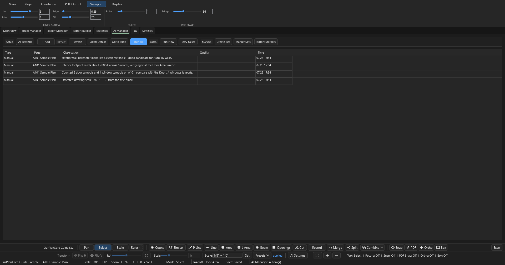
      <figcaption><code>AI Manager</code>: Setup / Review / Batch / Markers — Run AI, Run New, Retry Failed, маркер-сеты.</figcaption>
    </figure>

    !!! warning "AI safety"
        AI создаёт **review rows**, не quantities — гейт это кнопка `Apply Accepted`.
        Сохраняются request/response JSON и crop evidence (`<job>\AI_Context\`) — видно,
        по какому фрагменту предложен результат. Ключ показан как found/missing, без
        значения.

??? note ":material-file-chart-outline: Report Builder — COM-шаблон"

    Загружает Excel-шаблон сметы **`TemplateCom.xlsm`** в редактируемую таблицу
    (`Reload`, `Refresh`). Кнопка `Apply Walls` применяет A3-правило wall-блока к
    выделенным source-строкам в `J:K`. Инструмент **узкий** — под конкретный
    COM-шаблон, не универсальный генератор отчётов.

    <figure markdown>
      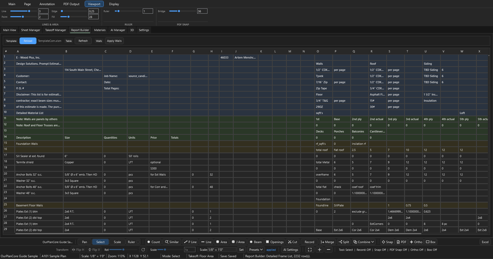
      <figcaption><code>Report Builder</code>: Reload TemplateCom.xlsm, Refresh, Apply Walls.</figcaption>
    </figure>

??? note ":material-package-variant-closed: Materials — извлечение материалов"

    Тянет **material evidence** из исходных PDF (schedules, ячейки таблиц, OCR) и
    строит сводку. Тулбар: `Extract`, `Report Sheet` (создаёт копируемый лист
    «Materials Report» под `00. reports`), `Refresh`, экспорт `JSON` / `Rows CSV` /
    `Summary CSV` / `Folder`.

    !!! note "Materials работает БЕЗ AI-ключа"
        Извлечение идёт через **встроенный Python** (pdfplumber + OCR), а не через
        OpenAI — `OPENAI_API_KEY` не нужен. GPT задействуется только в `AI Fill`
        Sheet Manager и в AI Manager.

    <figure markdown>
      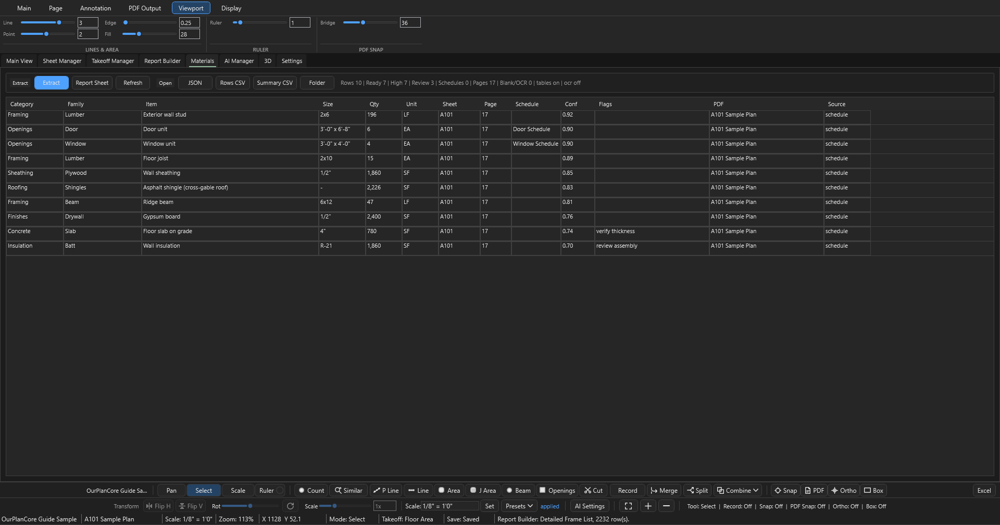
      <figcaption><code>Materials</code>: Extract, Report Sheet, экспорт JSON / CSV.</figcaption>
    </figure>

## Mental model { .kb-section-title .kb-st--green }

Программа построена вокруг **job folder** — всё локально, ничего в облаке.

| Слой | Что хранит | Source of truth для |
| --- | --- | --- |
| `Pages` | Sheets, scale, layers | Sheet name + scale |
| `Takeoffs` | Folders, items, sections | Quantity structure |
| `Measure` | Геометрия в PDF coords | Конкретные числа quantities |
| `AI` | Crops, requests, drafts | Доказательства (НЕ quantities — пока не accepted) |

!!! tip "Главная логика"
    `Page` отвечает за drawing context и scale. `Takeoff item` — за то, что
    считается. `Measurement` связывает: на каком sheet, с каким scale, в какой item
    записана геометрия.

## Архитектура и сборка { .kb-section-title .kb-st--blue }

??? note "Стек и disk-модель (для понимания, не для разработки)"

    - **Стек:** WPF desktop, `.NET 9` (`net9.0-windows`), `x64`. Namespace
      `OurPlanCore`.
    - **Three-panel shell:** Pages tree слева, PDF viewport по центру
      (SkiaSharp-overlay), Takeoffs tree справа; AI Inbox снизу (когда модуль AI вкл).
    - **PDF-рендер в два слоя:** (1) статичная картинка страницы — Python-воркер
      (PyMuPDF, `pdf_layers_helper.py`); (2) overlay measurements — `PdfViewport`
      (SkiaSharp); fallback — Docnet/PDFium.
    - **Геометрия:** `Line` = сумма отрезков × scale; `Area` = shoelace; `Count` =
      число маркеров. Каждый `Measurement` хранит свой `PageFolder` + scale.
    - **Autosave** — debounce 500 мс. Настройки — `%APPDATA%\OurPlanCore\
      settings.json`; логи — `%APPDATA%\OurPlanCore\logs\app-<date>.log`. Дефолтная
      папка job'ов — `Documents\OurPlanCore Jobs`. (Старое имя `OurPlaneCore` ещё
      читается для совместимости.)

## Горячие клавиши { #hotkeys .kb-section-title .kb-st--blue }

=== "Global / tools"

    | Клавиша | Действие |
    | --- | --- |
    | ++f1++ | Показать/закрыть шпаргалку клавиш |
    | ++esc++ | Закрыть помощь / отменить активное действие |
    | ++ctrl+o++ / ++ctrl+shift+o++ | Open / Import job · Recent |
    | ++ctrl+s++ | Save |
    | ++ctrl+m++ / ++ctrl+shift+m++ | Merge / Split сегментов |
    | ++ctrl+shift+p++ | Command Palette |
    | ++space++ | Старт/стоп `Record` |
    | ++t++ | Новый takeoff item |
    | ++b++ ++k++ | Add Bookmark (последовательно, до 0.9 с) |
    | ++f4++ / ++f5++ | Set Scale на выбранных листах / Open Name-Scale |
    | ++minus++ | Свернуть деревья Pages и Takeoffs |
    | ++v++ / ++e++ / ++s++ / ++r++ | Pan / Select / Scale / Ruler |
    | ++h++ / ++d++ / ++n++ | Highlighter / Draw Line (Extra Joists) / Note |
    | ++p++ / ++l++ / ++a++ / ++j++ | Count / Line / Area / Joist Area |
    | ++b++ / ++o++ / ++x++ | Beam / Openings / Area Cut |

=== "Viewport"

    | Клавиша | Действие |
    | --- | --- |
    | ++c++ | Завершить текущее рисование |
    | ++f++ | Fit page |
    | ++f2++ | Rename takeoff выбранного объекта |
    | ++f3++ / ++ctrl+f3++ | Snap / PDF Snap |
    | ++f8++ / ++f9++ | Ortho / Box mode |
    | ++shift++ | Временно форсить Ortho (при рисовании) |
    | ++ctrl+plus++ / ++ctrl+minus++ | Зум +/− |
    | ++ctrl+z++ / ++backspace++ | Undo действия / последней точки |
    | ++ctrl+a++ / ++ctrl+c++ / ++ctrl+v++ | Выбрать всё / копировать / вставить у курсора |
    | ++delete++ | Удалить выбранное |
    | ++ctrl++ / ++ctrl+shift++ / ++alt++ | Добавить-toggle / убрать из выбора / вершины |

=== "Trees / guides"

    | Клавиша | Действие |
    | --- | --- |
    | ++ctrl+c++ / ++ctrl+x++ / ++ctrl+v++ / ++ctrl+d++ | Copy / Cut / Paste / Duplicate |
    | ++ctrl+up++ / ++ctrl+down++ | Двигать узел вверх/вниз |
    | ++ctrl+enter++ | (Takeoffs) выбрать measurements секции на canvas |
    | ++f2++ / ++delete++ | Rename / Delete |
    | ++enter++ | Открыть выбранный bookmark / AI-запись |
    | ++tab++ | Layer Trace: цикл edge-snap / кандидата (после включения) |
    | 3D Roof guide: ++r++ ++h++ ++v++ ++e++ ++k++ ++p++ | Ridge / Hip / Valley / Eave / Rake / Pitch |

## See also

- [Создание Job и хранение](job-creation-storage.md) — где что лежит на диске, как ничего не терять
- [Как называть takeoffs](takeoff-naming.md) — правила naming + auto-routing
- [Workflow](../start/workflow.md) · [Структура takeoff](../start/takeoff-structure.md)
- [Excel macro hotkeys](excel-hotkeys.md) — VBA shortcuts после export
- [Советы и важные вещи](boss-feedback-rules.md)
